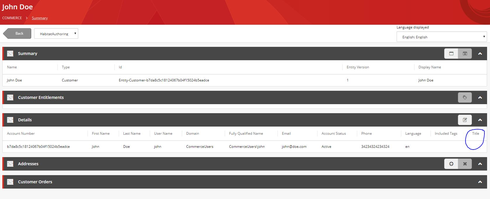
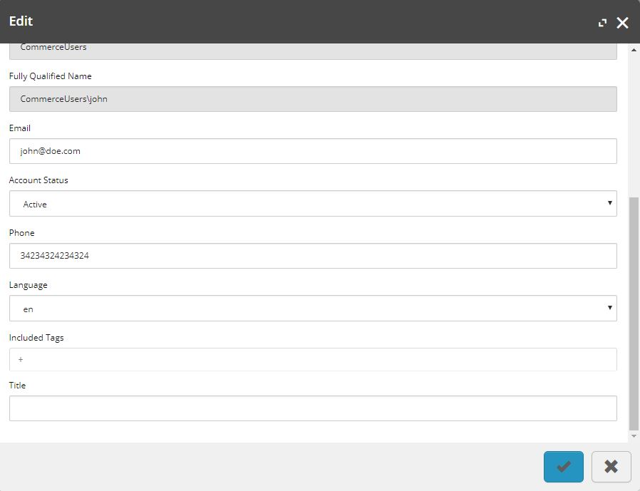
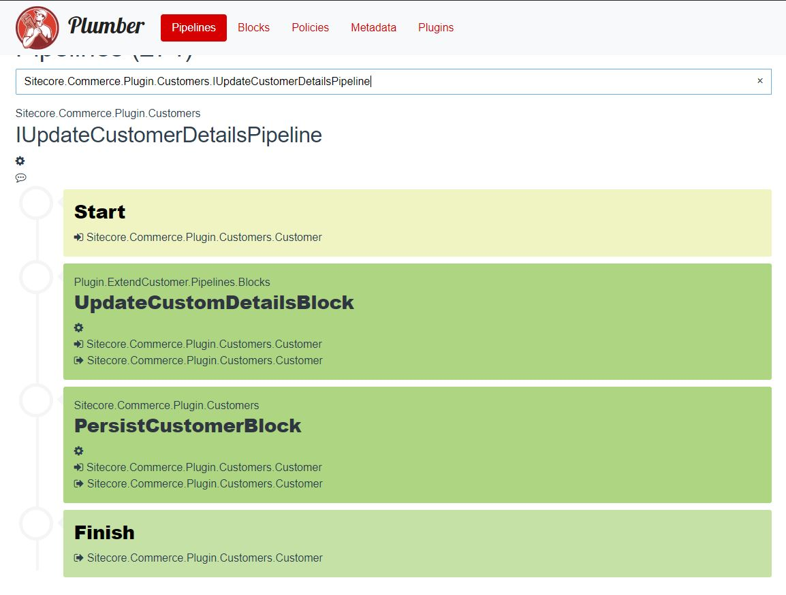

Multiple times I've seen people ask how to extend a SXC9 customer on the sitecore commerce slack channel. Suprisingly, it seems that this is not documented anywhere. We have already done this in our projects at Aviva Solutions, so I decided to write down how we do this. Full credits need to go to my colleague [Joost Meijles](https://twitter.com/joostmeijles), who figured this all out. 

<!--more-->

Like all commerce entities, to extend the customer you first need to create a custom component that will contain your custom field(s). For example, lets extend the customer with a title. 

``` csharp
public class CustomDetailsComponent : Component
{
    public string Title { get; set; }
}
```

Both commerce connect and the commerce business tools use the commerce views service, which makes the data consumable by a UI. To display the custom title field in the business tools you will need to extend the `IGetEntityView` pipeline. There is a [knowledge base article](https://kb.sitecore.net/articles/083614) that describes how to extend catalog entities and the concepts are the same. In this example we are going to add the Title field to the default details view, but you can also create a new view. The easiest way to add a field to the existing details view is by subclassing the `GetCustomerDetailsViewBlock` block and override the `PopulateDetails` method:

``` csharp
[PipelineDisplayName("MyPlugin:Blocks:GetCustomDetailsViewBlock")]
public class GetCustomDetailsViewBlock : Sitecore.Commerce.Plugin.Customers.GetCustomerDetailsViewBlock
{
    public GetCustomDetailsViewBlock(IGetLocalizedCustomerStatusPipeline getLocalizedCustomerStatusPipeline) : base(getLocalizedCustomerStatusPipeline)
    {
    }

    protected override async Task PopulateDetails(EntityView view, Customer customer, bool isAddAction, bool isEditAction, CommercePipelineExecutionContext context)
    {
        await base.PopulateDetails(view, customer, isAddAction, isEditAction, context);

        if(customer == null)
        {
            return;
        }

        var details = customer.GetComponent<CustomDetailsComponent>();
                    
        view.Properties.Add(new ViewProperty
        {
            Name = nameof(CustomDetailsComponent.Title),
            IsRequired = false,
            RawValue = details?.Title,
            IsReadOnly = !isEditAction && !isAddAction
        });
    }
}
```

Now when you replace the `GetCustomerDetailsViewBlock` block in the pipeline configuration (See end of this post) and view a customer in the business tools you will see the newly added title field:


            
You can also edit the customer and see the Title field, but it won't persist the value when you click save:



When you click save and the customer gets updated, the DoActionEditCustomer pipeline gets invoked. This pipeline first translates the EntityView back to a customer, using the `ITranslateEntityViewToCustomerPipeline` pipeline. Next, it invokes the `IUpdateCustomerDetailsPipeline` pipeline, which maps this temporary customer to an existing customer. 

First, we need to extend the `ITranslateEntityViewToCustomerPipeline` pipeline. The default implementation only maps all the fields back to the `CustomerDetailsComponent` component, so you will need to extend this pipeline and map the field to your custom component:

``` csharp
[PipelineDisplayName("MyPlugin:Blocks:TranslateEntityViewToCustomer")]
public class TranslateEntityViewToCustomerBlock : PipelineBlock<Customer, Customer, CommercePipelineExecutionContext>
{
    public override Task<Customer> Run(Customer customer, CommercePipelineExecutionContext context)
    {
        if (customer == null || !customer.HasComponent<CustomerDetailsComponent>())
        {
            return Task.FromResult(customer);
        }

        var details = customer.GetComponent<CustomerDetailsComponent>();
        var customDetails = new CustomDetailsComponent();

        foreach (EntityView view in details.View.ChildViews)
        {
            foreach (ViewProperty viewProperty in view.Properties)
            {
                if (viewProperty.Name == nameof(CustomDetailsComponent.Title))
                {
                    customDetails.Title = view.GetPropertyValue(viewProperty.Name)?.ToString();
                }
            }
        }
        
        customer.Components.Add(customDetails);

        return Task.FromResult(customer);
    }
}
```
Now, we need to extend the `IUpdateCustomerDetailsPipeline` pipeline, because the default only maps the `CustomerDetailsComponent` from the temporary customer to the existing customer. We will need to create a custom pipeline block to map our custom component:

``` csharp
 [PipelineDisplayName("MyPlugin:Blocks:UpdateCustomerDetailsBlock")]
    public class UpdateCustomDetailsBlock : Sitecore.Commerce.Plugin.Customers.UpdateCustomerDetailsBlock
    {
        public UpdateCustomDetailsBlock(IFindEntityPipeline findEntityPipeline) : base(findEntityPipeline)
        {
        }

        public override async Task<Customer> Run(Customer arg, CommercePipelineExecutionContext context)
        {
            var customer = await base.Run(arg, context);

            if (arg.HasComponent<CustomDetailsComponent>())
            {
                var customDetails = arg.GetComponent<CustomDetailsComponent>();
                customer.SetComponent(customDetails);
            }

            return customer;
        }
    }
```

Because you need both the input customer and the mapped customer, you will need to subclass the default block. This approach is less extensible, but as far as I know, there currently is no out of the box way to get the original input argument of a pipeline. When you look at the pipeline configuration using [plumber](http://plumber-sc.com/), it should look like the following:



Tying it all together, the pipeline configuration looks like this:

``` csharp
    public class ConfigureSitecore : IConfigureSitecore
    {
        public void ConfigureServices(IServiceCollection services)
        {
            var assembly = Assembly.GetExecutingAssembly();
            services.RegisterAllPipelineBlocks(assembly);

            services.Sitecore().Pipelines(config => config
                .ConfigurePipeline<IGetEntityViewPipeline>(c =>
                {
                    c.Replace<GetCustomerDetailsViewBlock, GetCustomDetailsViewBlock>();
                })
                .ConfigurePipeline<ITranslateEntityViewToCustomerPipeline>(c =>
                {
                    c.Add<Pipelines.Blocks.TranslateEntityViewToCustomerBlock>()
                     .After<TranslateEntityViewToCustomerBlock>();
                })
                .ConfigurePipeline<IUpdateCustomerDetailsPipeline>(c =>
                {
                    c.Replace<UpdateCustomerDetailsBlock,
                       Pipelines.Blocks.UpdateCustomDetailsBlock>();
                })
                .ConfigurePipeline<IRunningPluginsPipeline>(c =>
                {
                    c.Add<RegisteredPluginBlock>().After<RunningPluginsBlock>();
                }));
        }
    }
```

You can find the sample code on github: [https://github.com/Jonne/ExtendCustomerDemo](https://github.com/Jonne/ExtendCustomerDemo). Hope this helps anyone, please leave a comment if you have any questions or remarks.