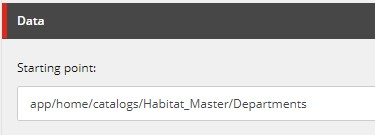
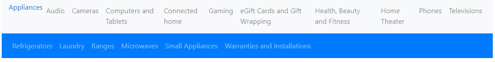
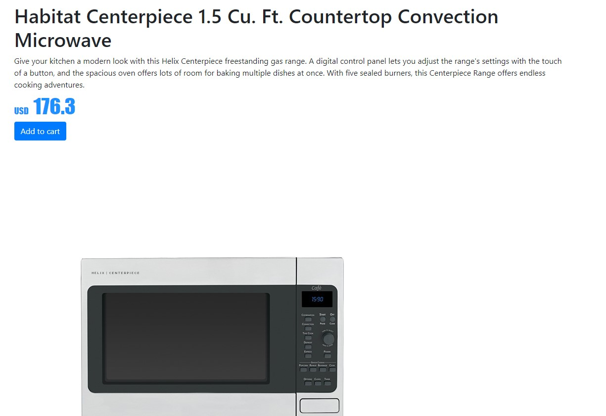
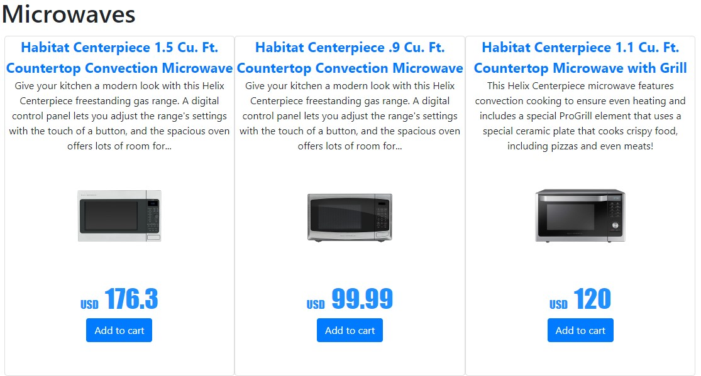

> JSS Commerce parts:
1. [Exposing the Commerce Engine](/2019/exposing-the-commerce-engine/)
2. [Navigating the catalog](/2019/navigating-the-catalog/)
3. [Cart actions](https://joost.meijles.com/jss_cart_actions/) - Joost Meijles
4. [Tracking Cart events](https://joost.meijles.com/jss_tracking_commerce/) - Joost Meijles
5. **Implementing catalog pages**
6. [Creating a product cluster](https://joost.meijles.com/jss_product_cluster/) - Joost Meijles
7. [Conclusion](/2019/jss-commerce-conclusion/)


## Category menu
The category menu is a list of categories that we want to display on all pages and which allows the visitor to navigate the categories in the catalog (A screenshot can be found at the end of this paragraph). We decided to implement a 2-level category menu (similar to the SXA storefront), meaning there will be two components. The first component will display the categories on a configurable level. The second component will display the child categories of the currently selected category of the other component. 

We scaffolded a new category JSS component by running `jss scaffold CategoryMenu`. This component will render a list of categories that it will receive through the props. 

``` javascript
import React from 'react';
import {fromPath} from '../../lib/LinkBuilder';
import { NavLink } from 'react-router-dom';

const CategoryNavItem = ({path, displayName, active}) => {
  const url = fromPath(path);

  let classNames = ['categorynavigation__navitem'];
  
  if(active) {
    classNames.push('active');
  }

  return <li className={classNames}><NavLink to={url}>{displayName}</NavLink></li>;
} 

const CategoryNavigation = ({fields}) => {
  const items = fields.categories ? fields.categories.map(c => <CategoryNavItem {...c} />) : null;

  return (
    <nav className='categorynavigation'>
      <ul>
        {items}
      </ul>
    </nav>
  );
};
  
export default CategoryNavigation;
```

Make sure to use the `NavLink` component from react-router for the links. If not, a full page refresh will be done when clicking the link. With the NavLink component only an asynchronous request will be done to the layout service, giving the visitor a much smoother experience.

To retrieve the categories, we chose to create a custom [content resolver](https://jss.sitecore.com/docs/techniques/extending-layout-service/layoutservice-rendering-contents), named `CategoryNavigationContentResolver`. As mentioned before, it should be configurable what categories to show. To do this, we have added a `Starting Point` field of type `DropTree` to the datasource template of the rendering, that allows the content editor to select a location in the catalog.



``` csharp
    public class CategoryNavigationContentResolver : RenderingContentsResolver
    {
        public override object ResolveContents(Sitecore.Mvc.Presentation.Rendering rendering, IRenderingConfiguration renderingConfig)
        {
            // Gets the datasource of the rendering that will contain the category starting point
            var contextItem = GetContextItem(rendering, renderingConfig);

            var linkField = (LookupField)contextItem.Fields[Templates.CategoryNavigation.StartingPoint];
            var categorySitecoreId = linkField.TargetID;
            var childCategories = GetChildCategories(categorySitecoreId);

            return new
            {
                Categories = childCategories?.Select(x => new
                {
                    x.ID,
                    Path = x.Paths.FullPath,
                    x.DisplayName,
                    Active = Sitecore.Context.Item.Paths.FullPath.Contains(x.Paths.FullPath)
                }).ToArray()
            };
        }

        private IEnumerable<Sitecore.Data.Items.Item> GetChildCategories(ID categorySitecoreId)
        {
            var searchManager = CommerceTypeLoader.CreateInstance<ICommerceSearchManager>();

            var searchIndex = searchManager.GetIndex();

            // This is ported from the SXA storefront code.
            using (var context = searchIndex.CreateSearchContext())
            {
                var category = context.GetQueryable<CommerceCategorySearchResultItem>()
                    .Where(x => x.ItemId == categorySitecoreId)
                    .Where(x => x.Language == Sitecore.Context.Language.Name)
                    .ToList();

                if (category.Count() == 0)
                {
                    return null;
                }

                var childrenCategories = category[0]["childrencategorylist"];

                if (string.IsNullOrEmpty(childrenCategories))
                {
                    return null;
                }

                var childrenCategoryIds = childrenCategories.Split(new[] { '|' }, StringSplitOptions.RemoveEmptyEntries);

                return childrenCategoryIds
                    .Select(x => Sitecore.Context.Database.GetItem(new ID(x)));
            }
        }
    }
```
The Subcategory navigation control looks similar, but has a different content resolver. This content resolver will use the `Sitecore.Context.Item` as a parent category instead of the configurable starting location. Other than that its the same.

Seeing both components in action:



## Product page
On the product page we wanted to display basic product information: title, description, image, price and an add-to-cart button. Joost already talked about the add-to-cart button in [part 3 of this series](https://joost.meijles.com/jss_cart_actions/), so I will focus on the other components here. JSS components usually get their data from a dedicated data source item. For the product detail components we want the components to get the data from the current Sitecore item: `Sitecore.Context.Item`. To access this data from your component you need to use the `withSitecoreContext` higher order component. For example, the component to display the product title looks like this:

``` javascript
import React from 'react';
import { Text, withSitecoreContext } from '@sitecore-jss/sitecore-jss-react';

const Title = (props) => (
  <h1 className='product__title'>
    <Text field={props.sitecoreContext.route.fields.Name} />
  </h1>
);

export default withSitecoreContext()(Title);
```

### Product images

Displaying the images was a bit more challenging. The JSS serializer will normally return the image url when an image field is used in the datasource. However, with Sitecore Commerce the product template has a `TreeList` that can link to multiple images. The default JSS serializer will not serialize the URL for these images. Best solution would probably to extend the serializer and return the URL, but for this experiment we decided to build an image url on the client using the image id:

``` javascript
import React from 'react';
import { Image, withSitecoreContext } from '@sitecore-jss/sitecore-jss-react';

function getImageUrlFromId(id) {
  const idWithoutDashes = id.replace(/-/g, "");
  return `${sitecoreApiHost}/~/media/${idWithoutDashes}.ashx`;
}

const DefaultProductImage = (props) => {

  const image = props.sitecoreContext.route.fields.Images.length > 0 && props.sitecoreContext.route.fields.Images[0];

  if(!image) {
    return null;
  }

  const url = getImageUrlFromId(image.id)
  const alt = image.fields.Alt.value;
  const field = {value:{src: url, alt: alt}};

  return <Image className='product__image' media={field} />
}

export default withSitecoreContext()(DefaultProductImage);
```

### Product price

Displaying the price also turned out to be more challenging. The sitecore product item does not include a list price and you need to invoke the Commerce Engine API to get this. One of the benefits of retrieving the list price asynchronously is that the entire page can be cached, while the price can be dynamic. The list price is included in the sellable item API and we can retrieve it by doing a GET on the flollowing url: `${gatewayUrl}/api/catalog/${productCatalog}/sellableitems/${productId}`. We created a custom React hook to get the live price of a product: 

``` javascript
import { useState, useEffect } from 'react';
import { gatewayUrl, productCatalog } from '../temp/config';

function useLivePrice(productId) {
    const [productData, setProductData] = useState();

    useEffect(() => {
      async function fetchData() {
        fetch(`${gatewayUrl}/api/catalog/${productCatalog}/sellableitems/${productId}`)
          .then(res => res.json())
          .then(data => setProductData(data))
      }
  
      fetchData();
    }, []);

    if(!productData) {
      return {};
    }

    return { 
        currencyCode: productData.ListPrice.CurrencyCode,  
        amount: productData.ListPrice.Amount
    };
}

export default useLivePrice;

```

This hook can than be used in our Price JSS component:

``` javascript

import React from 'react';
import { withSitecoreContext } from '@sitecore-jss/sitecore-jss-react';
import useLivePrice from '../../shared/useLivePrice';

const ProductPrice = (props) => {
  const {currencyCode, amount} = useLivePrice(props.sitecoreContext.route.fields.ProductId.value);

  return (
    <div className='price'>
      <span className='price__currency'>
        {currencyCode}
      </span>  
      <span className='price__price'>
        {amount}
      </span>
    </div>
  );
}

export default withSitecoreContext()(ProductPrice);

```



## Category page
For the category page we wanted to display the category title and a list of products in that category. To display the category title we could simply reuse the title component used on the product detail page. To display the products in that category we had a couple of options: 

1. Use a content resolver to get the products
2. Use an asynchronous GraphQL query
3. Directly query the commerce engine

Because retrieving the products can be a bit slow, we wanted to retrieve them asynchronously. This ruled out the use of a custom content resolver. Yes, the item can still be retrieved asynchronously by the layout service, but it still has to wait for all data to be loaded before the components on the page can be rendered. Because we were using the Commerce Connect Data Provider for navigating, we decided to go for the GraphQL approach. We ended up with the following GraphQL query:

``` graphql
query GetProducts($contextItem: String!) {
  item(path: $contextItem) {
    id
    path
    children(includeTemplateIDs: ["{14A80548-BAFA-451B-8844-56170152D1CF}"]) {
      path,
      displayName,
      productId: field(name: "ProductId"){
        value
      },
      description: field(name: "Description"){
        value
      },
      images: field(name: "Images"){
        value
      },
      children {
        name
      }
    }
  }
}
```

> Don't forget to [enable the GraphQL endpoint](https://jss.sitecore.com/docs/techniques/graphql/graphql-overview)

We use the GraphQL query in a products JSS component. This component uses a simple ProductList component to render the HTML for the products.

``` javascript
import React from 'react';
import ProductList from '../../shared/components/productlist';
import { loader as gqlLoader } from 'graphql.macro';
import GraphQLData from '../../lib/GraphQLData';

const GetProductsQuery = gqlLoader('./query.graphql');

const Products = (props) => {
  const graphQLResult = props.getProductsQuery;

  const { error, loading } = graphQLResult;

  // Query results load in using the name of their root field (see query.graphql)
  const { item } = graphQLResult;

  const products = item && item.children && item.children.map(p => ({
    path: p.path,
    productId: p.productId.value,
    displayName: p.displayName,
    description: p.description.value,
    imageId: p.images.value,
    variantId: p.children.length > 0 ? p.children[0].name : ''
  }));

  return <div className='productcluster'>
    {loading && <p className="alert alert-info">Loading products...</p>}
    {error && <p className="alert alert-danger">Error while loading products: {error.toString()}</p>}

    {products && <ProductList products={products}/>}
  </div>
};

export default GraphQLData(GetProductsQuery, { name: 'getProductsQuery' })(Products);

```

> Retrieving the products with the Items GraphQL endpoint is quite slow. An alternative worth investigating is trying to use the content search GraphQL endpoint.



This is starting to look like a real shop! JSS gives us a lot of flexibility and allowed us to quickly iterate on the front-end development. The real challenge is to figure out how to get the data in the JSS components. This got easier once we got the hang of how to use content resolvers and GraphQL queries.