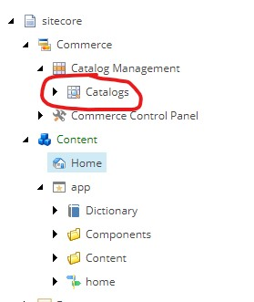
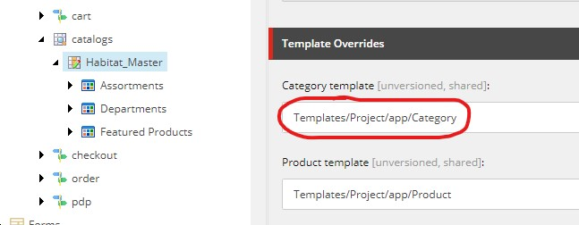

> JSS Commerce parts:
1. [Exposing the Commerce Engine](/2019/exposing-the-commerce-engine/)
2. **Navigating the catalog**
3. [Cart actions](https://joost.meijles.com/jss_cart_actions/) - Joost Meijles
4. [Tracking Cart events](https://joost.meijles.com/jss_tracking_commerce/) - Joost Meijles
5. [Implementing catalog pages](/2019/implement-catalog-pages/)
6. [Creating a product cluster](https://joost.meijles.com/jss_product_cluster/) - Joost Meijles
7. [Conclusion](/2019/jss-commerce-conclusion/)

As discussed in part 1, we decided to expose the Commerce Engine using an API gateway instead of creating a custom endpoint. This also means that we don't go through Sitecore Commerce Connect. We could choose to also access the catalog Commerce Engine API directly from JSS, but how would the content editor be able to use the experience editor to edit category and product pages? For this reason, we chose to still use the data provider that is part of Commerce Connect. 

When you install Commerce Connect, the catalog data provider is available at the following location:



One way to make these catalog items available, is by creating a custom item resolver for the `httpRequestBegin` pipeline. This resolver parses the current URL and maps it to a category or product from the catalog, which is set to `Context.Item`. After this Sitecore will serve the catalog item and the related layout. This requires custom coding, but offers a lot of flexibility in terms of the url structure you would like to use. This is also how the SXA storefront used to do it using the [wild card navigation](https://doc.sitecore.com/users/91/sitecore-experience-commerce/en/navigation-methods.html). 

Since 9.1 the SXA storefront has a new default type of navigation: [direct navigation](https://doc.sitecore.com/users/91/sitecore-experience-commerce/en/enable-direct-navigation.html). We are not using SXA, so we cannot use it. But it is really easy to implement with a simple ~~hack~~ trick. What the SXA storefront does when you enable direct navigation: it adds an item based on the `Commerce Catalog Folder` to the content tree. It turns out we can just do this manually. Just add a new item based on the `/sitecore/templates/Commerce/Catalog/Commerce Catalog Folder` template to a location under the site root level and enable the catalog that you would like to use.


In our case I called the item `catalogs` and the catalog urls will look like this: `/catalogs/Habitat_Master/Habitat_Master-Departments/Habitat_Master-Appliances`. To make sure that the items are working with JSS, we need to modify the template hierarchy of the catalog items to include the `/sitecore/templates/Project/app/App Route` template. This template is generated by JSS when you [deploy the app to Sitecore](https://jss.sitecore.com/docs/getting-started/app-deployment). You don't have to modify the out-of-the-box commerce templates, but you can create custom templates that derive from the default templates. For example, create a custom category template that derives from `/sitecore/templates/Commerce/Catalog/Commerce Category`. Also add the project specific App Route `/sitecore/templates/Project/app/App Route` to its base templates. After this, select the catalog and configure the template in Templates overrides: 



You can now add standard values for the custom template and configure the presentation details. In theory this is all you need to be able to navigate the catalog, but this is what happened when we tried to do that:

<iframe src="https://giphy.com/embed/A5cMONNFFwPgA" width="480" height="480" frameBorder="0" class="giphy-embed" allowFullScreen></iframe><p><a href="https://giphy.com/gifs/A5cMONNFFwPgA">via GIPHY</a></p>

This is because JSS will try to serialize the current Sitecore item and all items it references. Because a catalog will contain product relations this process will try to serialize the entire catalog and eventually end up in an infinite loop. To work around this we chose only to serialize a products relations one level deep by replacing the `GetMultilistFieldSerializer` with the following:

``` csharp
    public class ProductExcludingMultilistFieldSerializer : BaseFieldSerializer
    {
        private readonly ID productTemplateId = new ID("{225F8638-2611-4841-9B89-19A5440A1DA1}");
        protected readonly IItemSerializer ItemSerializer;

        public ProductExcludingMultilistFieldSerializer(IItemSerializer itemSerializer, IFieldRenderer fieldRenderer)
          : base(fieldRenderer)
        {
            Assert.ArgumentNotNull(itemSerializer, nameof(itemSerializer));
            ItemSerializer = itemSerializer;
        }

        public override void Serialize(Field field, JsonTextWriter writer)
        {
            Assert.ArgumentNotNull(field, nameof(field));
            Assert.ArgumentNotNull(writer, nameof(writer));

            using (RecursionLimit recursionLimit = new RecursionLimit(string.Format("{0}|{1}|{2}", GetType().FullName, field.Item.ID, field.ID), 1))
            {
                if (recursionLimit.Exceeded)
                {
                    return;
                }

                Item[] items = ((MultilistField)field).GetItems();
                if (items == null || items.Length == 0)
                {
                    writer.WritePropertyName(field.Name);
                    writer.WriteStartArray();
                    writer.WriteEndArray();
                }
                else
                {
                    writer.WritePropertyName(field.Name);
                    writer.WriteStartArray();
                    foreach (Item obj in items)
                    {
                        if (obj.IsDerived(productTemplateId))
                        {
                            continue;
                        }

                        writer.WriteStartObject();
                        writer.WritePropertyName("id");
                        writer.WriteValue(obj.ID.Guid.ToString());
                        writer.WritePropertyName("fields");
                        writer.WriteRawValue(ItemSerializer.Serialize(obj));
                        writer.WriteEndObject();
                    }
                    writer.WriteEndArray();
                }
            }
        }
    }
```

A serializer is created by a factory, so we need to create that as well:

``` csharp
    public class GetProductExcludingMultilistFieldSerializer : BaseGetFieldSerializer
    {
        public GetProductExcludingMultilistFieldSerializer(IFieldRenderer fieldRenderer)
          : base(fieldRenderer)
        {
        }

        protected override void SetResult(GetFieldSerializerPipelineArgs args)
        {
            Assert.ArgumentNotNull(args, nameof(args));
            Assert.IsNotNull(args.Field, "args.Field is null");
            Assert.IsNotNull(args.ItemSerializer, "args.ItemSerializer is null");
            args.Result = new ProductExcludingMultilistFieldSerializer(args.ItemSerializer, FieldRenderer);
        }
    }
```

Replace the default serialize with the following patch file:

``` xml
<configuration>
  <sitecore>
    <pipelines>
      <group groupName="layoutService">
        <pipelines>
          <getFieldSerializer>
            <processor type="Sitecore.LayoutService.Serialization.Pipelines.GetFieldSerializer.GetMultilistFieldSerializer, Sitecore.LayoutService" resolve="true">
              <patch:attribute name="type">Jss.Commerce.Pipelines.GetFieldSerializer.GetProductExcludingMultilistFieldSerializer, Jss.Commerce</patch:attribute>
            </processor>
          </getFieldSerializer>
        </pipelines>
      </group>
    </pipelines>
  </sitecore>
</configuration>
```

After this we were able to navigate the catalog.