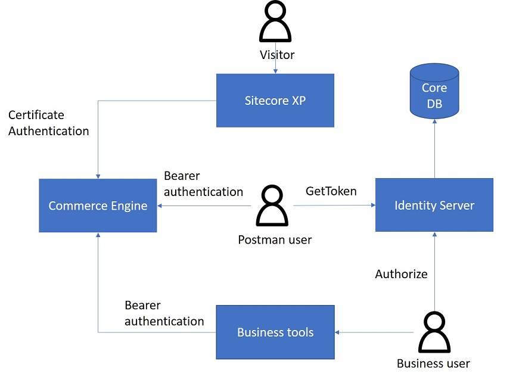
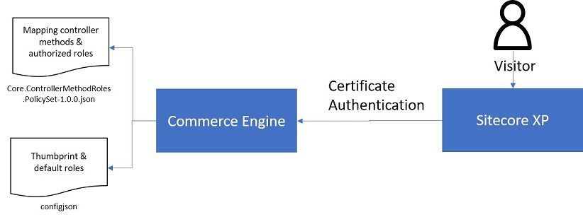
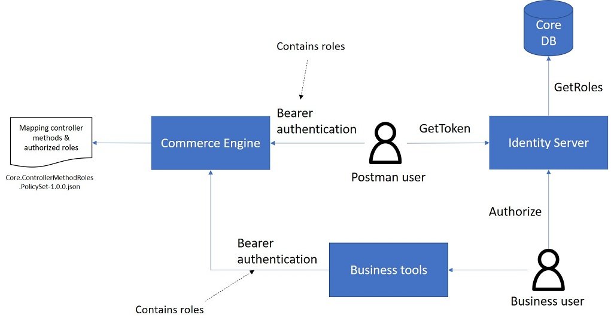

# Authentication
As stated by the [SXC9 documentation](https://doc.sitecore.com/developers/91/sitecore-experience-commerce/en/authentication.html), there are two ways to authenticate with the commerce engine.

## Certificate authentication
In the case of certificate authentication a certificate thumbprint is passed to the engine in the HTTP headers. This thumbprint is configured in the `config.json` file of the engine and is validated for every request.

## Bearer token authentication
With bearer token authentication a token is needed to authenticate with the commerce engine. This token can be obtained from Identity Server with sitecore credentials. There are two ways to do this:

### GetToken
Identity Server provides a GetToken HTTP endpoint that accepts the sitecore credentials and returns a bearer token. This token can be used to communicate with the engine. The GetToken endpoint is mostly used by automated scripts or by the postman scripts that are part of the commerce SDK.

### Authorize 
This endpoint is used by the business tools. When the user opens the business tools, the user is redirected to the authorize endpoint of Identity Server, which shows a login page. After the user has successfully entered credentials, the user is redirected to the business tools with the access token as a query parameters. That token can then be used by the business tools to access the commerce engine.

)

# Authorization
Authorization in the commerce engine is based on user roles and controller actions. This is configured in the `Core.ControllerMethodRoles.PolicySet-1.0.0.json` policy file, which content contains elements that look like the following:

``` JSON
      {
        "$type": "Sitecore.Commerce.Core.ControllerMethodRolesPolicy, Sitecore.Commerce.Core",
        "ControllerMethodRegularExpression": "/api/",
        "AuthorizedRoles": [
          "sitecore\\Commerce Business User"
        ]
      }
```

The `ControllerMethodRegularExpression` contains a regular expression that indicates to what api routes the policy applies. The `AuthorizedRoles` states what roles are authorize to access that route. So if you need to add authorization to you own controller methods, you need to add it here.

What roles the current client has is determined differently for certificate authentication and bearer authentication.

## Certificate authentication
In the case of certificate authentication the roles are configured in the `config.json` file along with the thumbprint:

``` json
    {
        "Thumbprint": "5A78A3F2E27B1E10F281AF0B953BE404FD53757B",
        "DefaultRoles": [
          "sitecore\\QA",
          "sitecore\\Commerce Business User"
        ]
    }
```

)


## Bearer token authentication
When the client is authenticated with bearer authentication the token will contain the roles of the user in its claims. When the user logs in using Identity Server, Identity Server will retrieve the users roles from the core database and return them in the token.

